# 软件设计说明书

## 一、主界面

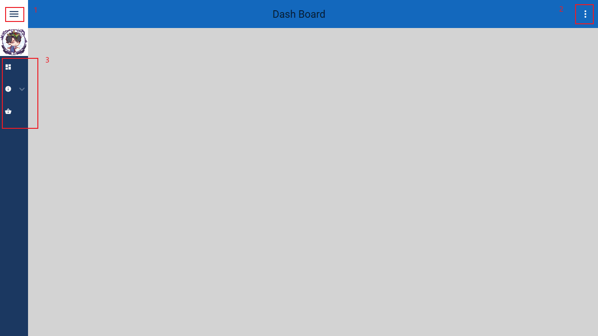

图1-1 DashBoardView 收缩状态

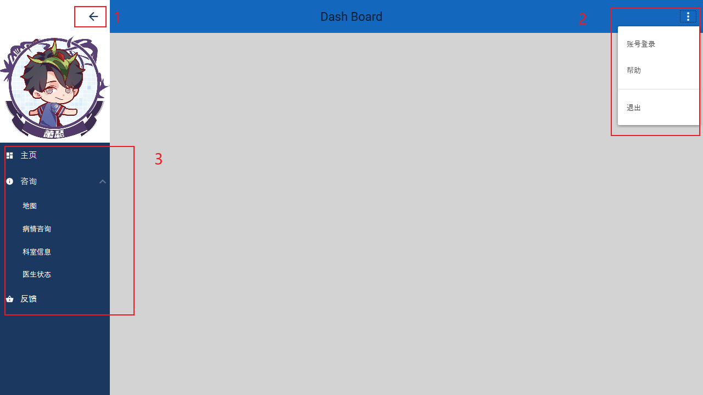

图1-2 DashBoardView 展开状态

`①：功能栏展开按钮`
`②：更多选项`
`③：功能栏`

未登录状态下的主界面如上图1、图2，右上角三个点可以选择 “ **账号登录** ” 进入账号登录界面来登录自己的权限账号。

登录后的 **DashBorad** 界面布局相同，根据登录的不同的账号权限，自动生成不同的功能栏界面，下文的图片将仅展示功能栏展开的情况。

## 二. 帐号登录

> **账号权限：**
>
> 1. 管理员
> 2. 普通用户
> 3. 医生
> 4. 药师
> 5. 挂号员
> 6. 收费员

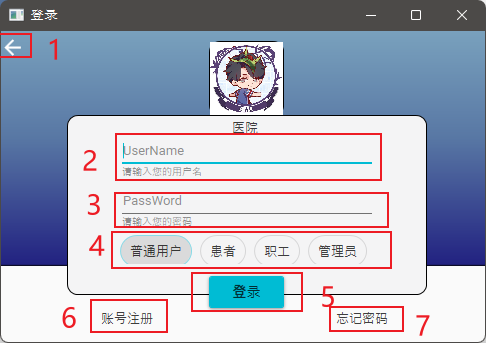

图2-1 LoginView

`①：返回 DashBoard 界面`
`②：用户名文本框`
`③：密码框`
`④：用户权限选择`
`⑤：登录按钮`
`⑥：跳转到帐号注册界面`
`⑦：跳转到找回密码界面`

在 **LoginView** 中

输入 (**用户名  ----  密码**)、选择登录的**用户权限**进行帐号登录。

> 1. 若帐号不在数据库中，则提示"帐号不存在，是否前往注册帐号"；
> 2. 若帐号存在数据库中，密码错误，则提示"密码错误，是否忘记密码"；
> 3. 若帐号存在数据库中且与其密码对应，则提示"登陆成功，欢迎    $用户权限$  + \$UserName\$ "。

## 三. 账号注册

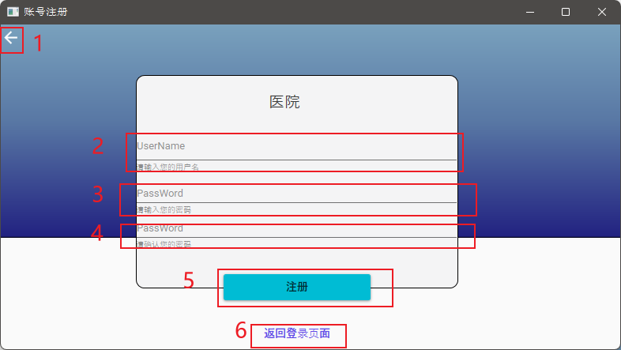

图3-1 RegisterView

`①：返回 DashBoard 界面`
`②：用户名文本框`
`③：密码框1`
`④：密码框2`
`⑤：注册按钮`
`⑥：返回登录界面`

2.在 **RegisterView**中

输入  **(用户名  ----  密码  ----  确认密码)**  进行账号注册。

> 1. 若两次输入密码不相同，则注册失败，提示"两次输入密码不同，注册失败"
> 2. 若两次输入密码相同但帐号已在数据库中，则注册失败，提示"帐号已存在，注册失败"；
> 3.  若两次输入密码相同且帐号不在数据库中， 则提示"注册成功"。

## 四.找回密码

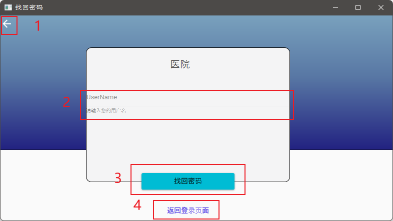

图4-1 RetrPwdView

`①：返回 DashBoard 界面`
`②：用户名文本框`
`③：找回密码按钮`
`④：返回登录界面`

在 **RetrPwdView** 中

用户可以填写自己的用户名，然后点击找回密码按钮，即可得到该用户名对应的密码。

> 1. 若用户名不存在，则提示 “此账号不存在，请尝试注册账号”
> 2. 若用户名存在，则提示“用户 \$UserName\$ ,您好,您的密码可能是 \$UserPwd$ ”

## 五.功能详解

### 1.管理员

#### 1.1 管理员主界面

图5-1.1 DashBoardView 管理员界面

`①：显示登陆账户的权限和用户名`
`②：显示不同权限的不同功能按钮`

#### 1.2 查看所有用户信息：

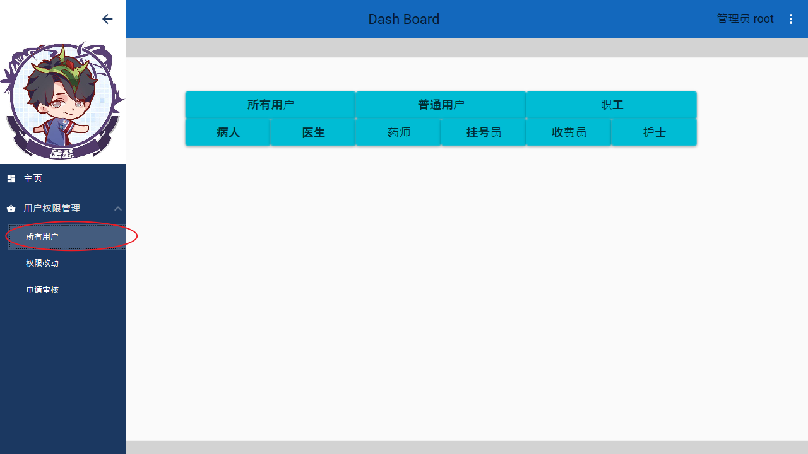

图5-1.2 管理员界面-所有用户

点击**所有用户**，跳转到用户信息界面表，可按照权限不同查看不同的用户信息表。

#### 1.3 更改用户的权限：

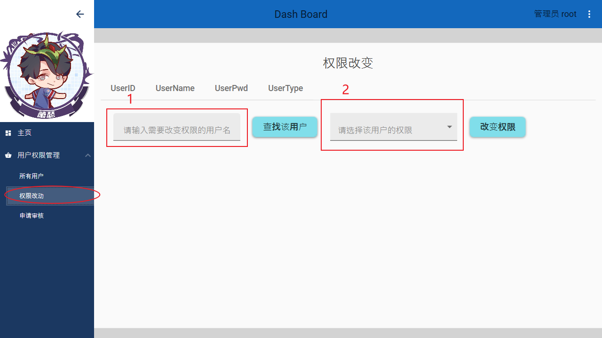

图5-1.3-1 管理员界面-权限改动

点击**权限改动**，跳转到权限改动界面。

1. 可以**输入需要改变权限的用户名**，上方会跳出用户的详细信息，进行核对；

2. 在**改变权限**处选择需要赋予用户的权限；
3. 根据选择的权限不同，需要管理员输入不同的信息

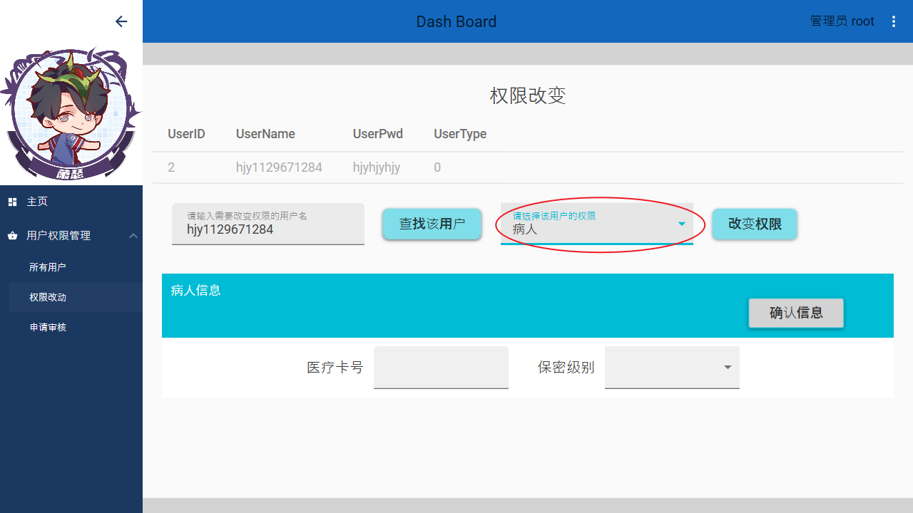

图5-1.3-2 管理员界面-权限改动(病人)

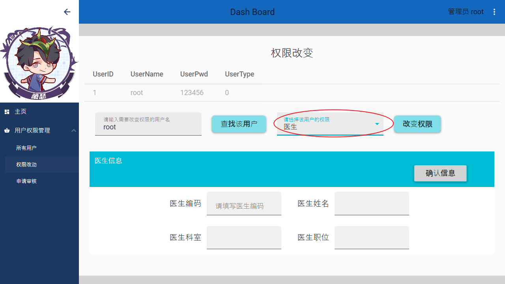

图5-1.3-3 管理员界面-权限改动(医生)

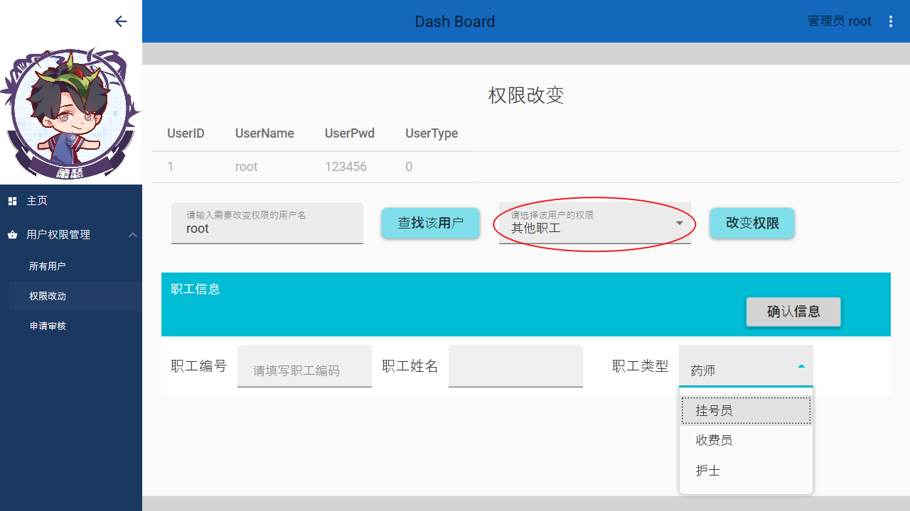

图5-1.3-4 管理员界面-权限改动(其他职工)

### 2.用户

#### 2.1 用户主界面

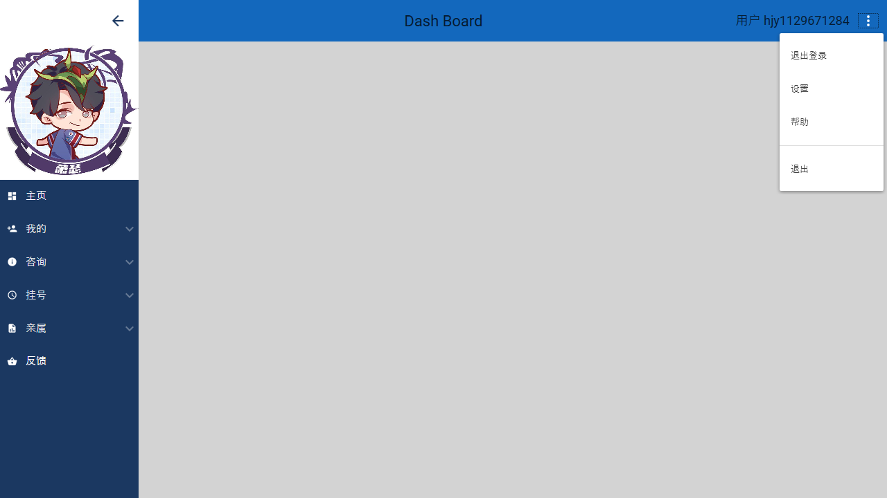

图5-2.1 DashBoardView 普通用户界面

#### 2.2 填写/更改个人信息：

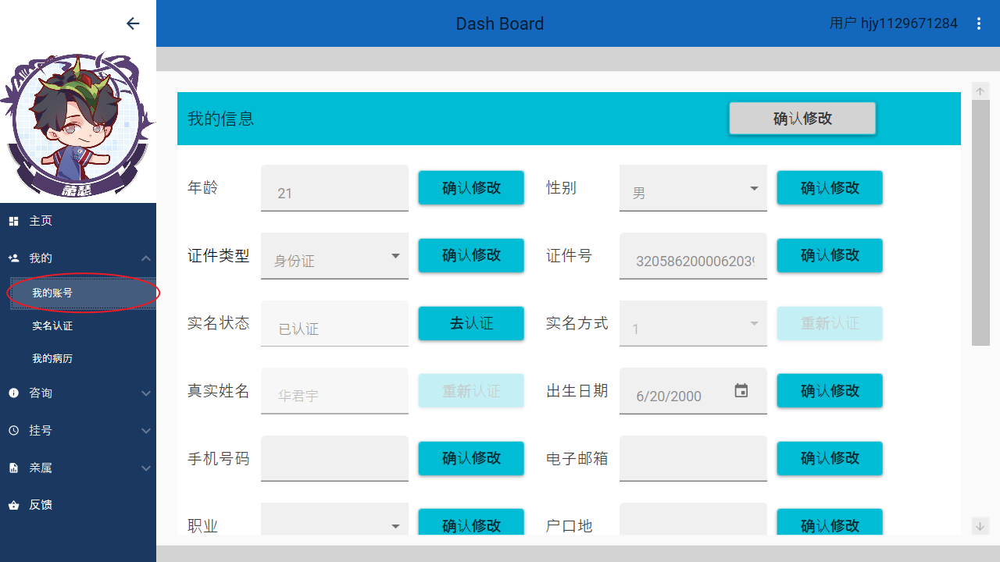

图5-2.2-1 普通用户界面-我的帐号

点击 **我的帐号** ，可以跳转到个人信息界面。

> 1. 填写对应信息  ->   点击确认修改按钮 ，即可修改数据库中的信息
> 2. 填写身份证号：
>    1. 校验身份证号是否为18位，为否则提示"身份证号错误，请确认输入的是18位身份证"
>    2. 校验前两位号码是否为地区编码，为否则提示"非法地区"
>    3. 校验第7-14位是否是出生日期，为否则提示"非法生日"
>    4. 校验前17位加权和对11取余，校验失败则提示"非法证号"
>    5. 身份证号输入符合规范，则自动修改用户的性别以及出生日期、年龄

#### 2.2 帐号设置

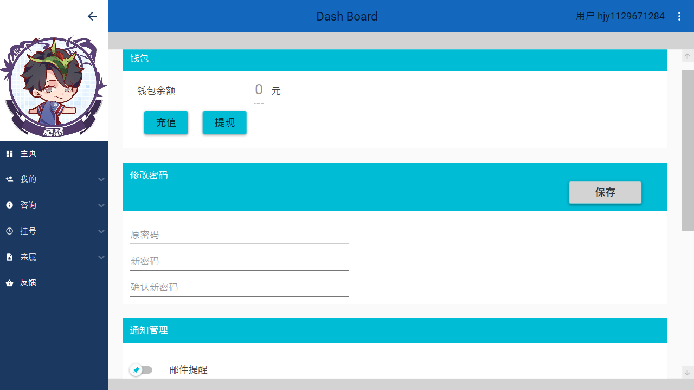

图5-2.2-2 普通用户界面-设置1

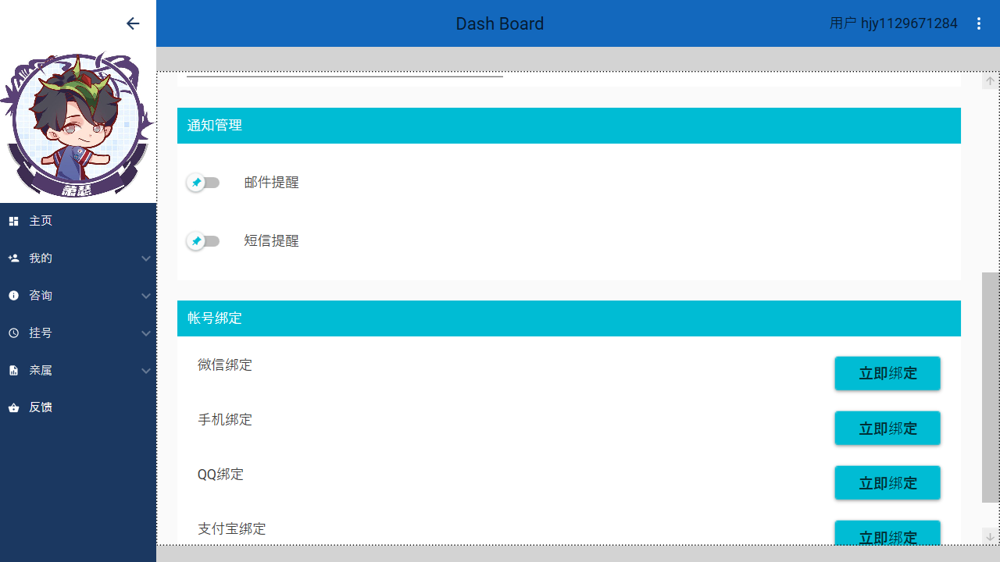

图5-2.2-3 普通用户界面-设置2

在 DashBoradView 界面右上角三个点选择设置，进入帐号设置界面。

> 1. 钱包可以查看用户当前的余额
> 2. 修改密码中可以填写原密码和两次新密码来修改当前密码
> 3. 其余的只做了界面，功能没有完成

### 3.挂号员

#### 3.1挂号员主界面

图5-3.1 DashBoardView 挂号员界面

#### 3.2挂号员功能

##### 3.2.1查看患者信息：

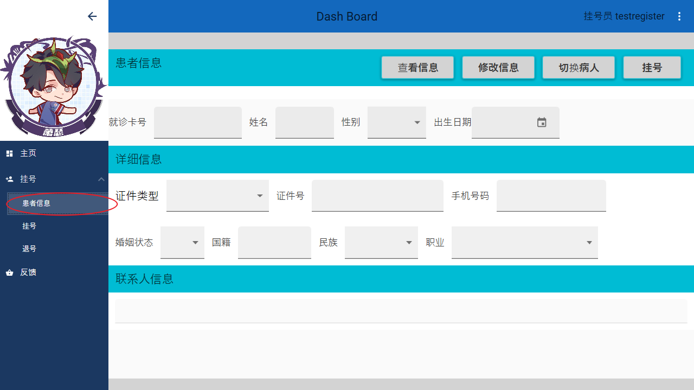

图5-3.2.1 挂号员界面-患者信息

`查看信息按钮：根据填写的就诊卡号获取患者信息`
`修改信息按钮：根据修改的信息修改患者的信息`
`切换病人按钮：清空该病人信息以填写下一位病人`
`挂号按钮：跳转到挂号界面，并自动填充该病人的就诊卡号`

点击**患者信息** 进入查看患者信息界面

> 1. 输入患者**就诊卡号**后回车，患者信息自动填充，可以查看。
>
> 2. 输入就诊卡号后点击挂号，即可给对应患者挂号

##### 3.2.2挂号 ：

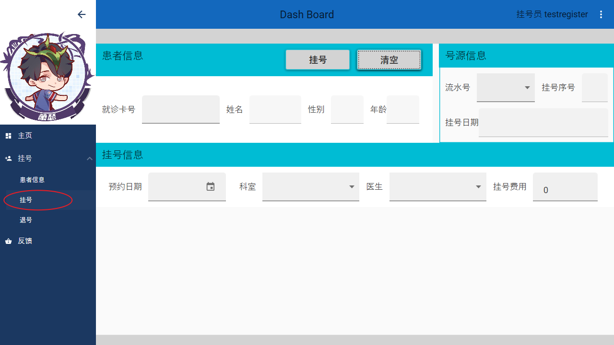

图5-3.2.2-1 挂号员界面-挂号

点击 **挂号** 或者 从患者信息点击 **挂号按钮**，即可进入挂号界面 

输入 **就诊卡号并回车——自动填充个人信息——选择流水号或者添加流水号——选择预约日期——选择科室——选择空闲的医生——点击挂号**；

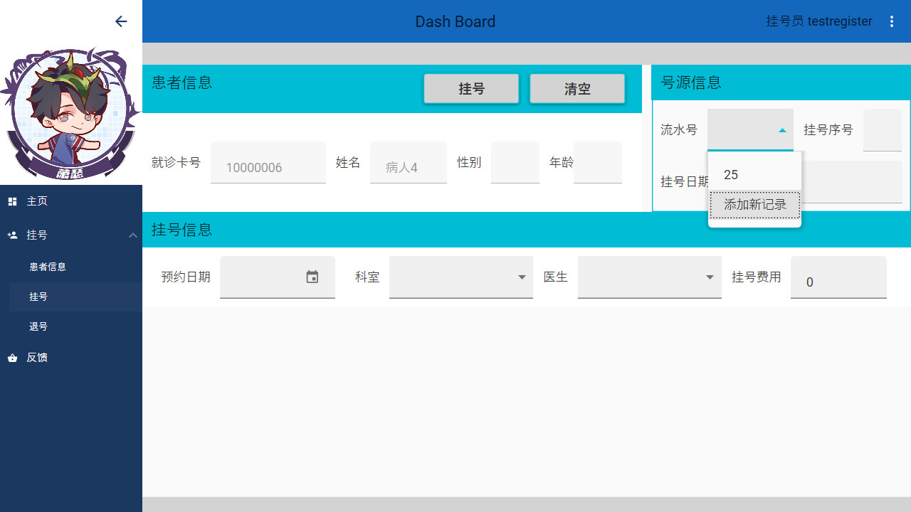

图5-3.2.2-2 挂号员界面-挂号-选择流水号

> 1. 选择流水号后自动填写挂号序号以及挂号日期
> 2. 选择科室后自动生成空闲医生列表
> 3. 预约日期不填写默认为当前时间

##### 3.2.3退号：

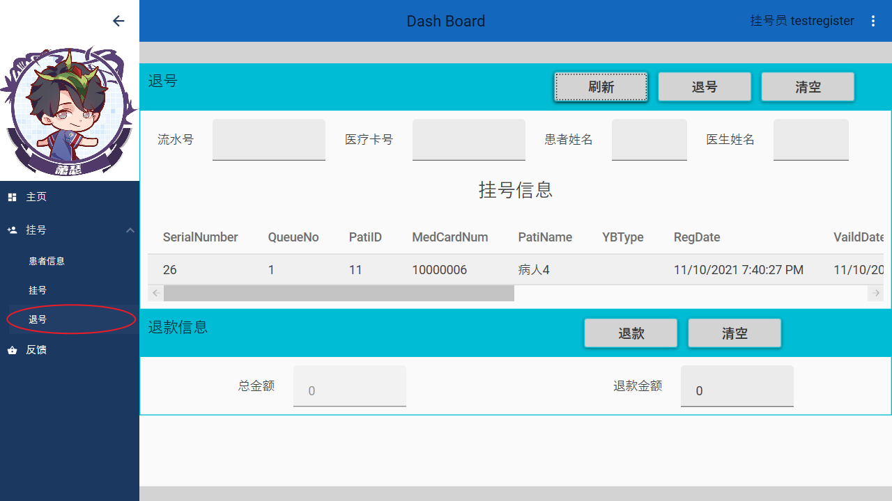

图5-3.2.3 挂号员界面-挂号-选择流水号

选择 **退号** 即可进入退号界面

> 1. 选择性填写上方的四个筛选信息，双击挂号信息的内容，即可自动获取退款信息中的总金额。
>
> 2. 填写退款金额（不小于总金额），点击退款即可将金额退款到用户的帐号中；
> 3. 点击退号，即可给用户退号。

### 4.收费员

#### 4.1收费员界面

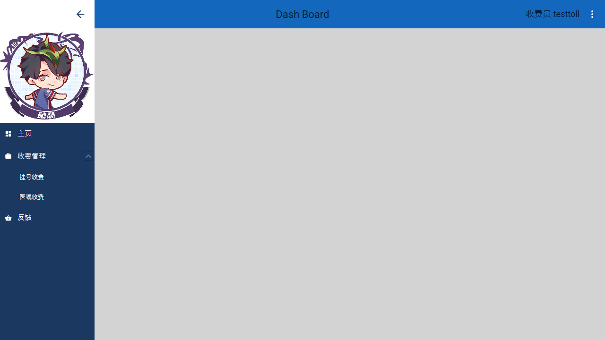

图5-4.1 DashBoardView 收费员界面

#### 4.2收费功能

4.2.1挂号收费

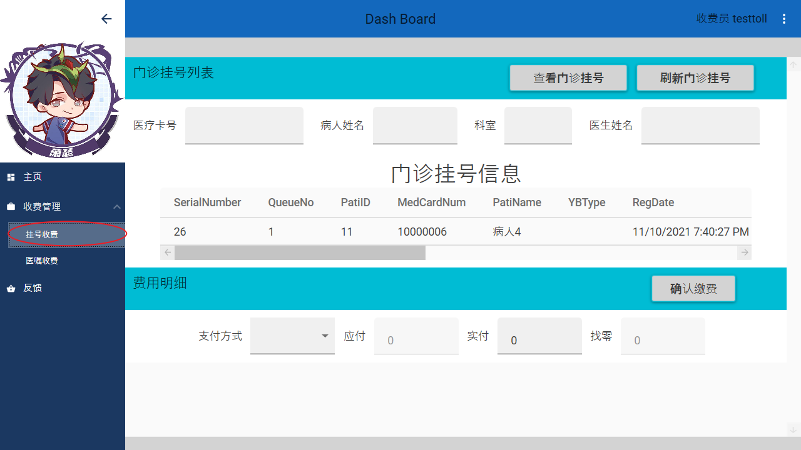

图5-4.2-1.1 收费员界面-挂号收费

> 1. 选择性输入上方四个筛选信息，双击门诊挂号信息的内容，即可自动填写费用明细中的应付金额
> 2. 在费用明细中选择支付方式，填写实付金额，系统将会自动填写找零金额
> 3. 点击确认缴费按钮即可完成缴费

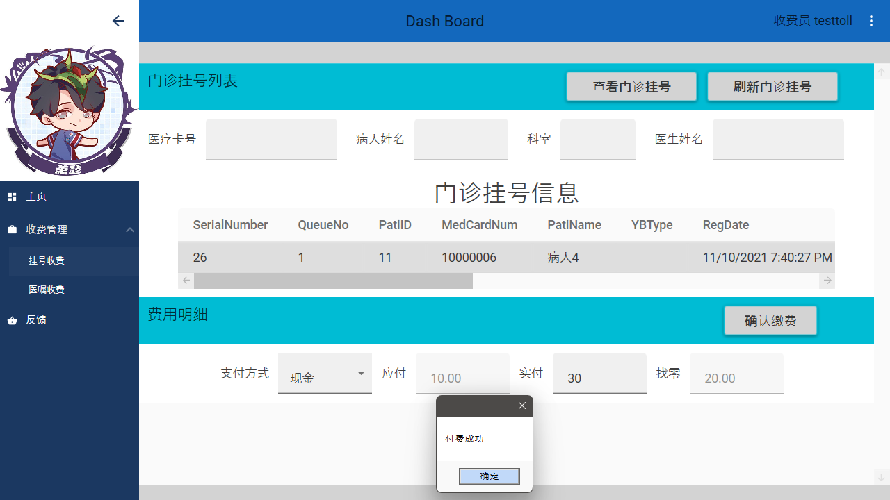

图5-4.2-1.2 收费员界面-挂号收费成功

4.2.2医嘱收费

图5-4.2-2.1 收费员界面-医嘱收费

> 1. 选择性输入上方四个筛选信息，双击医嘱信息的内容，即可自动填写费用明细中的应付金额
> 2. 在费用明细中选择支付方式，填写实付金额，系统将会自动填写找零金额
> 3. 点击确认缴费按钮即可完成缴费

图5-4.2-2.2 收费员界面-挂号收费成功

### 5.医师

#### 5.1医师主界面

图5-5.1 DashBoardView 医师界面

#### 5.2医师工作站

5.2.1 科室患者

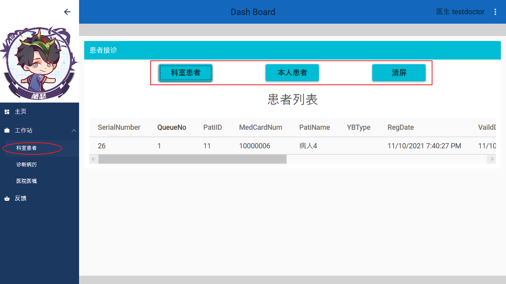

图5-5.2-1 医师界面-科室患者

`科室患者按钮：查看医师所在科室的患者`
`本人患者按钮：查看医师的患者`
`清屏按钮：清空患者列表`

> 1. 选择 **科室患者** ，即可查看医师所在科室以及挂号在医生下的患者列表。
> 2. 双击患者列表的信息，即可跳转到**诊断病历**界面。

5.2.2诊断病历：

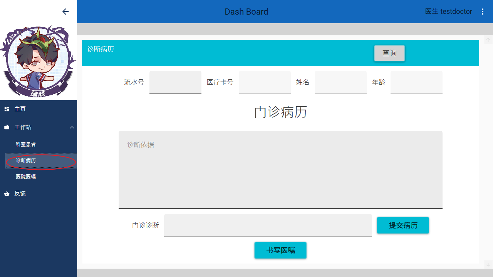

图5-5.2-2 医师界面-诊断病历

选择 **诊断病历** 或者在科室患者中双击患者列表中的信息，即可跳转到诊断病历界面

> 
>
> 1. 输入**流水号——回车或点击查询按钮——书写门诊病历——提交病历** 即可完成病历书写
> 2. 点击**书写医嘱**，即可跳转到医院医嘱界面并自动填写流水号

5.2.3医嘱书写：

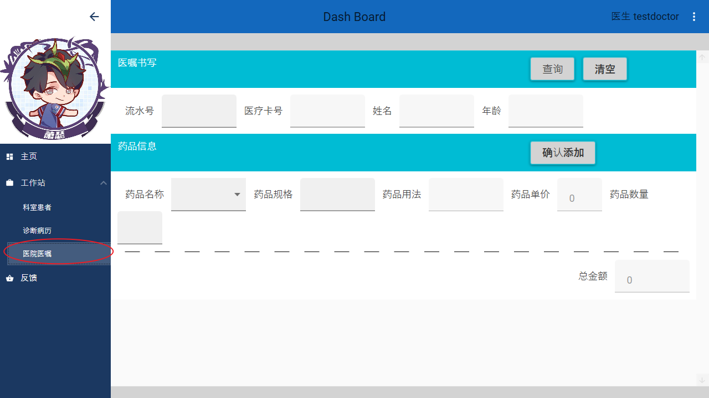

图5-5.2-3.1 医师界面-医院医嘱

点击 **医院医嘱** 或 在诊断病历中点击**书写医嘱**按钮，即可跳转到医院医嘱界面

> 1. 输入流水号
> 2. 核对自动填充的患者信息
> 3. 选取药品
> 4. 自动生成药品规格、药品用法、药品单价
> 5. 填写数量
> 6. 自动计算总金额

图5-5.2-3.2 医师界面-医院医嘱-添加成功

### 6.药师

#### 6.1药师主界面

图5-6.1 DashBoardView 药师界面

#### 6.2用药管理

6.2.1医嘱列表

图5-6.2-1 药师界面-医嘱列表

点击**医嘱列表**即可进入医嘱列表界面

> 1. 选择性填写上方三个筛选信息——回车或者点击查看医嘱
> 2. 双击生成的医嘱信息列表里的一条记录，自动跳转到**医嘱执行**界面。

6.2.2医嘱执行

图5-6.2-2.1 药师界面-医嘱执行

> 1. 填写医嘱编号，自动生成该医嘱对应的患者信息
> 2. 药师可根据门诊诊断以及医师开的医嘱，选择是否将医嘱退回
> 3. 选择性填写备注
> 4. 点击执行医嘱按钮，即可进行医嘱执行

## 分工

| 任务         | 成员   |
| ------------ | ------ |
| 前端代码     | 葛雪雯 |
| 后端代码     | 华君宇 |
| 软件测试     | 柏敦徽 |
| 数据库设计   | 赵跃   |
| 使用文档编写 | 韩炳豪 |

